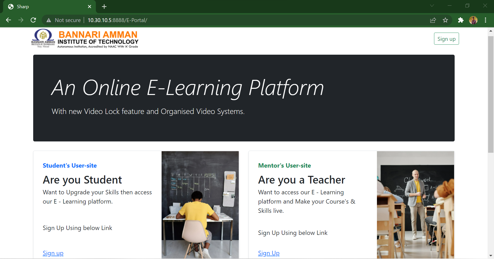
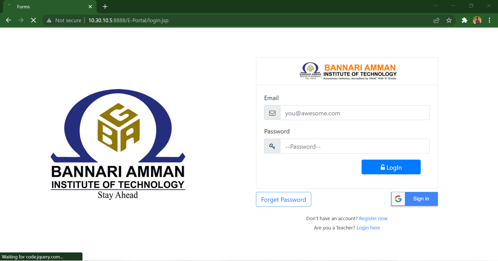
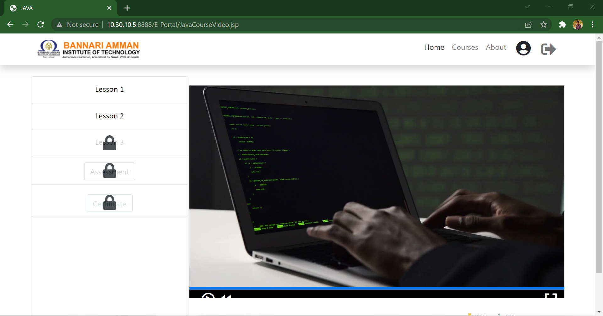

<h2>Hello 👋</h2>

This is an 🌐 Online <b>E - Learning Portal</b>, with <b><em>Video Content Lock Feature.</em></b>

<h3>⚡Language's and Tools Used: </h3>

    
    
    
    

<h2>⚠️ Server Runtime Specific</h2>
<h4>Java Version 📌 16.0.1</h4>
<h4>Runtime 😺 Tomcat 9.0.5</h4>

<h2>🚢 Deployment (branch 2)</h1>

<b><i>⚠️ This Deployment Need's Docker installed</i></b>

In branch 2 you can find <b>🐟 Dockerfile and docker-compose file.</b>

    docker-compose build
    docker-compose up

<h4>Out</h4>

    localhost:8888/E-Portal
    yourIp:8888/E-Portal

<h2><i>else</i></h2>
<b>🟢 You can find a <i>.war</i> file in branch 2 you can Deploy it Directly with Tomcat.</b>

<h2>🗃️ Database Deployment</h2>

The <b>.sql file is also given in branch 2</b> you need to deploy it with SQl Databsae ( MySQL ) and change the Database settings in the <b>config File.</b>

<h2>📸 Gallery</h2>

###

###

